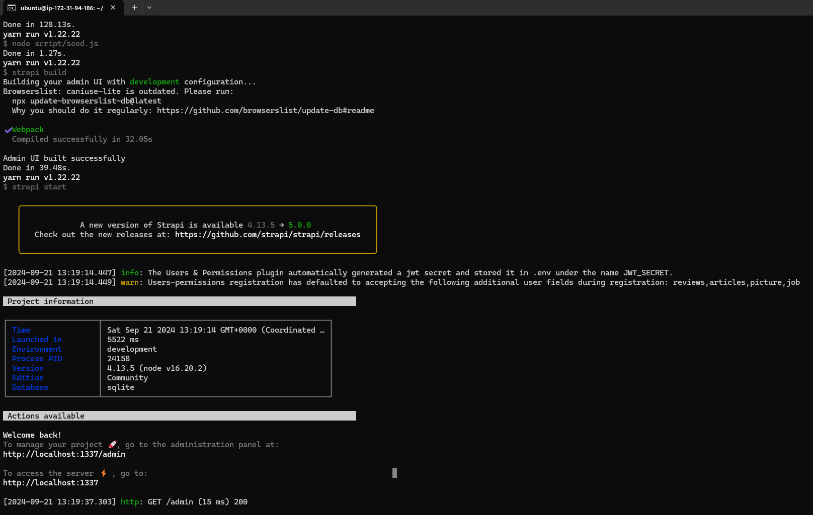

# CS360 1/2567 Term Project: [FoodAdvisor]

## Table of Contents 
- [Group Information](#group-information)
- [Project Goal](#project-goal)
  - [Feature](#feature)
  - [Technologies Used](#technologies-used)
  - [Software Requirement](#software-requirement)
- [Setup AWS EC2 Instance](#setup-aws-ec2-instance)
- [How to Deploy and Run the Project Manually](#how-to-deploy-and-run-the-project-manually)
- [How to Deploy and Run the Project Using the Provided Bash Script](#how-to-deploy-and-run-the-project-using-the-provided-bash-script-specify-the-bash-script-path-in-the-repo)
- [Unit and Integration Testing Overview](#unit-and-integration-testing-overview)
- [Setting Up Tests](#setting-up-tests)
- [Running Tests](#running-tests)
- [Test File Structure](#test-file-structure)
- [Test Coverage](#test-coverage)
- [Viewing Test Results](#viewing-test-results)
- [Adding New Tests](#adding-new-tests)
- [Node.js CI Workflow](#nodejs-ci-workflow)
  - [Workflow Triggers](#workflow-triggers)
  - [CI Environment Matrix](#ci-environment-matrix)
  - [Workflow Steps](#workflow-steps)
  - [Visualize Test Results in GitHub Actions](#visualize-test-results-in-github-actions)
  - [GitHub Actions Configuration](#github-actions-configuration)
- [Project Screenshot](#project-screenshot)

## Group Information 

- **Group Name:** PakPok

- **Members:**   

    | Name                         | Student ID |
    |------------------------------|------------|
    | Sakkapong Phiphatpornchaikul | 6309545033 |
    | Chayanon Khanrit             | 6409682538 |
    | Supakorn Oupkaew             | 6409682918 |
    | Anallena Libha               | 6409682942 |

## Project Goal
The goal of the FoodAdvisor project is to create a user-friendly platform that facilitates seamless content management and enhances user engagement. The aim is to further enhance this platform to make it even more user-friendly and customizable to meet users' needs. This will deliver a comprehensive solution that simplifies content management, improves the user experience, and fosters collaboration within the food community.

### - Feature
- **Feature 1:** Dynamic Food Menu

### - Technologies Used
- **Backend:** Strapi V4
- **Frontend:** Next.js
- **Hosting/Deployment:** AWS EC2
- **Database:** SQLite

### - Software Requirement 
  |software | version  |
  |---------|----------|
  | node    | 16       |
  | npm     | 8        |
  | yarn    | 1        |
  | curl    | 7        |
  | nvm     | 0.3      |
  | git     | 2        |

## Setup AWS EC2 Instance

> [!NOTE]
>- **Launch AWS EC2 Instance:**
>    - Instance Type: t2.medium
>    - AMI: Amazon Linux 2023 AMI
>    - Operating System: Amazon Linux
>    - Storage: 1x16 GiB gp3 Root volume
>
>- **Configure Security Group Rules:**
>      | Type           | Protocol  |  Port Range  |  Source        |
>      |----------------|-----------|--------------|----------------|
>      |SSH             | TCP       | 22           |::/0            |
>      |HTTP            | TCP       | 80           |0.0.0.0/0, ::/0 |
>      |Custom TCP Rule | TCP       | 1337         |0.0.0.0/0      |
>      |Custom TCP Rule | TCP       | 3000         |0.0.0.0/0      |

### Step by step:
1. **Log into AWS Management Console:**
        
    - Go to the AWS Management Console and `sign in` to your AWS account.

2. **Select EC2 Service:**

    - Click on `Services` and then select `EC2` from the list of services.

3. **Launch Instance:**

    - Click on `Launch Instance` to start the process of creating a new EC2 Instance.

4. **[Choose an Amazon Machine Image (AMI)](#Launch-AWS-EC2-Instance):**

    - Select Amazon Linux 2023 AMI.

5. **[Launch AWS EC2 Instance](#Launch-AWS-EC2-Instance):**

    - Select t2.medium .

6. **[Add Storage](#Launch-AWS-EC2-Instance):**

    - Choose 16 Gib gp3.

7. (Optional) **Add Tags:** 

    - Add tags for resource management, such as Name: MyEC2Instance.

8. **[Configure Security Group Rules](#Configure-Security-Group-Rules):** 

    - Create a new Security Group or select an existing one to set rules for accessing the Instance. 

9. **Select Key Pair:**

    - Create a new Key Pair or select an existing Key Pair to allow SSH access to the Instance.

10. **Launch Instance:**

    - Click `Launch Instances` and wait for the EC2 Instance to be created.

11. **Access EC2 Instance:**

    - Use command 
            
            ssh -i "path/to/your-key.pem" ec2-user@<EC2-Public-IP> 
    
        to connect to the EC2 Instance using the IP Address and Key Pair you created. 

## How to deploy and run the project manually

### Step by step:
After launching your EC2 instance and downloading the key pair for SSH access, follow these steps:

- ### Install curl and node version 16:

    **Run the commands in order:**

    1. Updates the package lists for available software, ensuring you have the latest information.
            
            sudo yum update
        
    2. Installs curl, a tool for transferring data from or to a server.

            sudo yum install curl

    3. Downloads and executes the installation script for Node.js version 16.x.

            curl -fsSL https://rpm.nodesource.com/setup_16.x | sudo -E bash -

    4. Installs Node.js without requiring user confirmation.

            sudo yum install -y nodejs

- ### Install git:

    - run 
    
            sudo yum install git 
        
        to install git.

- ### Install yarn:

    **Run the commands in order:**

    1. Downloads Yarn's GPG key and adds it to the system's list of trusted keys, ensuring that packages from the Yarn repository can be verified.

            curl --silent --location https://dl.yarnpkg.com/rpm/yarn.repo | sudo tee /etc/yum.repos.d/yarn.repo

    2. Updates the local package index, so the system is aware of the latest packages available from the newly added Yarn repository.

            sudo yum update

    3. Installs Yarn, a package manager for JavaScript, using the APT package manager.

            sudo yum install yarn

After install curl, node, git, and yarn, follow these steps: 

1. **Clone the Repository:** 

    - run 
        
            git clone https://github.com/Chayanon6409682538/ProjectCS360_foodadvisor.git

    - Navigate to your project folder by running 
    
            cd ProjectCS360_foodadvisor 
            
        from your command line.

2. **Setup .env:**

    - **backend**

        - To get PublicIPv4 use: 
    
                curl ipinfo.io/ip

        - To get PREVIEW_SECRET use:

                openssl rand -base64 32

        1. **Creat.env File**

                nano  api/.env

        2. **Copy this code and paste in .env file**
    
                HOST=0.0.0.0
                PORT=1337
                STRAPI_ADMIN_CLIENT_URL=http://<Your public IPv4 EC2 instance>:3000
                STRAPI_ADMIN_CLIENT_PREVIEW_SECRET=<Your PREVIEW_SECRET>

    - **frontend**

        1. **Creat.env File**

                nano  client/.env

        2. **Copy this code and paste in .env file**

                NEXT_PUBLIC_API_URL=http://<Your public IPv4 EC2 instance>:1337
                PREVIEW_SECRET=<Your PREVIEW_SECRET>

3. **Start Strapi:** 

    - Navigate to your `./foodadvisor/api` folder by running 
    
            cd api 
            
        from your command line.

    - then run 
    
            yarn && yarn seed && yarn build && yarn start &

4. **Start Next.js:** 

    - Navigate to your `./foodadvisor/client` folder by running 
        
            cd client 
            
        from your command line.

    - then run 
    
            yarn && yarn build && yarn start

5. **Accessing Strapi Backend on EC2:**

    - http://[EC2 public ip]:1337 for strapi backend

6. **Accessing Next.js Frontend on EC2:**

    - http://[EC2 public ip]:3000 next.js frontend

## How to deploy and run the project using the provided bash script [Specify the bash script path in the repo]

After launching your EC2 instance and downloading the key pair for SSH access, follow this steps:

- ### Install git:

    - run 
    
            sudo yum install git 
        
        to install git.

After install git, follow these steps:

1. **Clone the Repository:** 
    - run 

            git clone https://github.com/Chayanon6409682538/ProjectCS360_foodadvisor.git

    - Navigate to your project folder by running 

            cd ProjectCS360_foodadvisor 
    
        from your command line.

2. **Run the Deployment Script:**

    - Ensure the script is executable by running 

            chmod +x install_strapi_foodadvisor.sh

    - Execute the script by running 

            ./install_strapi_foodadvisor.sh

## Unit and Integration Testing Overview
In the FoodAdvisor project, which is a food menu application using Strapi for the backend and Next.js for the frontend.

- Testing Tools

    - Jest: For both Unit and Integration Testing, to validate functions and module interactions.

    - Supertest: For validating API endpoints.

    - Strapi Testing Utils: For streamlining testing of the Strapi backend APIs.

## Setting Up Tests
Install Testing Dependencies by running

        yarn add jest supertest --save-dev

## Running Tests
### Step by step:
1. Navigate to your `./foodadvisor/client` folder by running

        cd client 

    from your command line. 

2. Install dependencies by running

        yarn

3. To run all Unit and Integration tests across both frontend and backend components, use the following command below

        yarn test

## Test File Structure

### clien test

    client/
    ├── _tests_/                      
    │   ├── menu.test.js/ 

## Test Coverage
### 1. Create Menu Function
    describe('createMenu', () => {
    it('should create a menu item and return it', async () => {
      const mockResponse = {
        data: {
          id: 1,
          name: 'New Menu',
          price: 0.00,
          type: 'Main Menu',
          isAvailable: false,
          photo: {
            data: {
              id: 1,
            },
          },
        },
      };

      fetch.mockResolvedValueOnce({
        ok: true,
        json: jest.fn().mockResolvedValueOnce(mockResponse),
      });

      const params = {
        name: 'New Menu',
        price: 0.00,
        type: 'Main Menu',
        isAvailable: false,
        photo: {
          data: {
            id: 1,
          },
        },
      };

      const result = await createMenu(params);

      expect(fetch).toHaveBeenCalledWith(`${process.env.NEXT_PUBLIC_API_URL}/api/menus`, {
        method: 'POST',
        headers: { 'Content-Type': 'application/json' },
        body: JSON.stringify(params),
      });
      expect(result).toEqual(mockResponse);
    });

    it('should throw an error when the response is not ok', async () => {
      fetch.mockResolvedValueOnce({ ok: false });

      await expect(createMenu({ name: 'Pizza', price: 10 })).rejects.toThrow('Failed to create menu item');
    });
    
    });

### 2. Connect Relation Function

    describe('connectRelation', () => {
    it('should connect menu to restaurant and return updated menu', async () => {
      const mockResponse = { data: { id: 1, name: 'Pizza' } };
      fetch.mockResolvedValueOnce({ ok: true, json: jest.fn().mockResolvedValueOnce(mockResponse) });

      const result = await connectRelation(1, 1);

      expect(fetch).toHaveBeenCalledWith(`${process.env.NEXT_PUBLIC_API_URL}/api/restaurants/1`, {
        method: 'PUT',
        headers: { 'Content-Type': 'application/json' },
        body: JSON.stringify({ data: 
                              { menus: 
                                { connect: [1] } 
                              } 
                            }),
      });
      expect(result).toEqual(mockResponse);
    });

    it('should handle fetch errors in connectRelation', async () => {
      fetch.mockRejectedValueOnce(new Error('Network error'));

      await expect(connectRelation(1, 1)).rejects.toThrow('Network error');
    });
    });

### 3. Update Menu Function

    describe('updateMenu', () => {
    it('should update a menu item and return it', async () => {
      const mockResponse = { data: { id: 1, name: 'Not Updated Menu' } };
      fetch.mockResolvedValueOnce({ ok: true, json: jest.fn().mockResolvedValueOnce(mockResponse) });

      const result = await updateMenu(1, { name: 'Updated Menu' });

      expect(fetch).toHaveBeenCalledWith(`${process.env.NEXT_PUBLIC_API_URL}/api/menus/1`, {
        method: 'PUT',
        headers: { 'Content-Type': 'application/json' },
        body: JSON.stringify({ name: 'Updated Menu' }),
      });
      expect(result).toEqual(mockResponse);
    });

    it('should throw an error when updating fails', async () => {
      fetch.mockResolvedValueOnce({ ok: false });

      await expect(updateMenu(1, { name: 'Updated Menu' })).rejects.toThrow('Failed to update menu item');
    });

    });

### 4. Delete Menu Function

    describe('deleteMenu', () => {
    it('should delete a menu item and return it', async () => {
      const mockResponse = { data: { id: 1 } };
      fetch.mockResolvedValueOnce({ ok: true, json: jest.fn().mockResolvedValueOnce(mockResponse) });

      const result = await deleteMenu(1);

      expect(fetch).toHaveBeenCalledWith(`${process.env.NEXT_PUBLIC_API_URL}/api/menus/1`, {
        method: 'DELETE',
        headers: { 'Content-Type': 'application/json' },
      });
      expect(result).toEqual(mockResponse);
    });

    it('should throw an error when deletion fails', async () => {
      fetch.mockResolvedValueOnce({ ok: false });

      await expect(deleteMenu(1)).rejects.toThrow('Failed to delete menu item');
    });

  });

### 5. Change Photo Function

    describe('changePhoto', () => {
    const mockFile = new File([''], 'photo.jpg', { type: 'image/jpeg' });

    it('should upload a new photo and update the menu item', async () => {
      const mockResponse = { data: { id: 1, photo: { data: { id: 2 } } } };
      
      // Mock responses for fetching, deleting, and uploading
      fetch.mockResolvedValueOnce({ ok: true, json: jest.fn().mockResolvedValueOnce({ data: { attributes: { photo: { data: { id: 1 } } } } } ) });
      fetch.mockResolvedValueOnce({ ok: true }); // for delete photo
      fetch.mockResolvedValueOnce({ ok: true, json: jest.fn().mockResolvedValueOnce([{ id: 2 }]) }); // for upload new photo
      fetch.mockResolvedValueOnce({ ok: true, json: jest.fn().mockResolvedValueOnce(mockResponse) }); // for updating menu

      const result = await changePhoto(mockFile, 1);

      expect(fetch).toHaveBeenCalledWith(`${process.env.NEXT_PUBLIC_API_URL}/api/menus/1?populate=photo`);
      expect(fetch).toHaveBeenCalledWith(`${process.env.NEXT_PUBLIC_API_URL}/api/upload`, expect.any(Object));
      expect(result).toEqual(mockResponse);
    });

    it('should throw an error when retrieval fails', async () => {
      fetch.mockResolvedValueOnce({ ok: false });

      await expect(changePhoto(mockFile, 1)).rejects.toThrow('Failed to retrieve menu item. Status: undefined');
    });

    it('should throw an error when deletion of old photo fails', async () => {
      fetch.mockResolvedValueOnce({ ok: true, json: jest.fn().mockResolvedValueOnce({ data: { attributes: { photo: { data: { id: 1 } } } } }) });
      fetch.mockResolvedValueOnce({ ok: false });

      await expect(changePhoto(mockFile, 1)).rejects.toThrow('Failed to delete old photo. Status: undefined');
    });

    it('should throw an error when upload fails', async () => {
      fetch.mockResolvedValueOnce({ ok: true, json: jest.fn().mockResolvedValueOnce({ data: { attributes: { photo: { data: { id: 1 } } } } }) });
      fetch.mockResolvedValueOnce({ ok: true });
      fetch.mockResolvedValueOnce({ ok: false });

      await expect(changePhoto(mockFile, 1)).rejects.toThrow('Failed to upload new photo. Status: undefined');
    });

    it('should handle the case where there is no existing photo', async () => {
      const mockFile = {}; // Replace with actual file mock if needed
      const mockResponse = { data: { attributes: { photo: { id: 2, url: "new-photo-url.jpg" } } } };
    
      // 1. Check for an existing photo and return null (indicating no existing photo)
      fetch.mockResolvedValueOnce({ ok: true, json: jest.fn().mockResolvedValueOnce({ data: { attributes: { photo: null } } }) });
    
      // 2. No deletion of old photo since there is no existing photo
      // 3. Mock successful upload response for the new photo
      fetch.mockResolvedValueOnce({ ok: true, json: jest.fn().mockResolvedValueOnce([{ id: 2 }]) });
    
      // 4. Mock response for updating the menu item with the new photo
      fetch.mockResolvedValueOnce({ ok: true, json: jest.fn().mockResolvedValueOnce(mockResponse) });
    
      // Run the function and verify it returns the expected result
      const result = await changePhoto(mockFile, 1);
      expect(result).toEqual(mockResponse);
    });
  

## Viewing Test Results 
This is the test result:

        Menu Services Tests
    createMenu                                                                                                                                                   
      √ should create a menu item and return it (3 ms)                                                                                                           
      √ should throw an error when the response is not ok (19 ms)                                                                                                
    connectRelation                                                                                                                                              
      √ should connect menu to restaurant and return updated menu (2 ms)                                                                                         
      √ should handle fetch errors in connectRelation (3 ms)                                                                                                     
    updateMenu                                                                                                                                                   
      √ should update a menu item and return it (2 ms)                                                                                                           
      √ should throw an error when updating fails (1 ms)                                                                                                         
    deleteMenu                                                                                                                                                   
      √ should delete a menu item and return it (1 ms)                                                                                                           
      √ should throw an error when deletion fails (1 ms)                                                                                                         
    changePhoto                                                                                                                                                  
      √ should upload a new photo and update the menu item (40 ms)
      √ should throw an error when retrieval fails (5 ms)                                                                                                        
      √ should throw an error when deletion of old photo fails (8 ms)                                                                                            
      √ should throw an error when upload fails (7 ms)                                                                                                           
      √ should handle the case where there is no existing photo (5 ms)                                                                                                                                                                                                                                                  
    ------------------|---------|----------|---------|---------|-------------------                                                                                  
    File              | % Stmts | % Branch | % Funcs | % Lines | Uncovered Line #s                                                                                   
    ------------------|---------|----------|---------|---------|-------------------
    All files         |     100 |      100 |     100 |     100 | 
    menu-services.js  |     100 |      100 |     100 |     100 | 
    ------------------|---------|----------|---------|---------|-------------------
    Test Suites: 1 passed, 1 total
    Tests:       13 passed, 13 total
    Snapshots:   0 total
    Time:        7.556 s
    Ran all test suites.
    Done in 21.85s.

## Adding New Tests

Create new files in `_tests_` and following this pattern:

    // xxxx.test.js
    describe('Feature Name', () => {
        it('should do something specific', () => {
            // Test implementation
        });
    });

# Node.js CI Workflow

## Workflow Triggers
The workflow is triggered on:

- Push events to `master` and `dev` branches

- Pull request events to `master` and `dev` branches

## CI Environment Matrix
The workflow runs tests across the following combinations:

#### Operating Systems
- ubuntu-latest

#### Node.js Versions
- 16.x

## Workflow Steps:
1. Check code

        clone repository uses: actions/checkout@v4

2. Setup node.js

        uses: actions/setup-node@v4
        with:
            node-version: ${{ matrix.node-version }}

3. Install yarn

        run: npm install -g yarn

4. Install dependencies in api
      
        run: yarn
        working-directory: ./api

5. Build project 

        run: yarn build
        working-directory: ./api

6. Install dependencies in client

        run: yarn
        working-directory: ./client

7. Test unit test client

        run:
            yarn test   
        working-directory: ./client

## Visualize Test Results in GitHub Actions
1. Go to `Action` page.
2. Selected latest workflows.
3. Selected passed job.
4. Selected test unit and test client.

After completed, these steps will show the test results.

## GitHub Actions Configuration
This workflow uses the following configuration `(YAML file)`:

    name: Github Actions Workflow

    on: 
    push:
        branches: [master, dev ]
    pull_request:
        branches: [ master, dev ]

    jobs:
    build:

    strategy:
      matrix:
        os: [ubuntu-latest, redhat-lastest]
        node-version: [16.x]
    runs-on: ${{ matrix.os }}
    env:
      HOST: '0.0.0.0'
      PORT: '1337'
      APP_KEYS: 'mock'
      API_TOKEN_SALT: 'mock'
      #TRANSFER_TOKEN_SALT: 'mock'
      #DATABASE_CLIENT: 'sqlite'
      #DATABASE_FILENAME: '.tmp/data.db'
      JWT_SECRET: ${{ secrets.JWT_SECRET }}
      ADMIN_JWT_SECRET: ${{ secrets.ADMIN_JWT_SECRET }}
      STRAPI_ADMIN_CLIENT_PREVIEW_SECRET: ${{ secrets.STRAPI_ADMIN_CLIENT_PREVIEW_SECRET }}

    steps:
    - name: Check code
      uses: actions/checkout@v4
    - name: Setup node.js ${{ matrix.node-version }}
      uses: actions/setup-node@v4
      with:
        node-version: ${{ matrix.node-version }}
    - name: Install dependencies
      run: yarn install
      working-directory: ./api

    - name: Build project  
      run: yarn build
      working-directory: ./api

    - name: Test  
      run: 
        yarn test
        echo "my STRAPI_ADMIN_CLIENT_PREVIEW_SECRET is ${{ secrets.STRAPI_ADMIN_CLIENT_PREVIEW_SECRET }}"
      working-directory: ./api

## Project Screenshot

