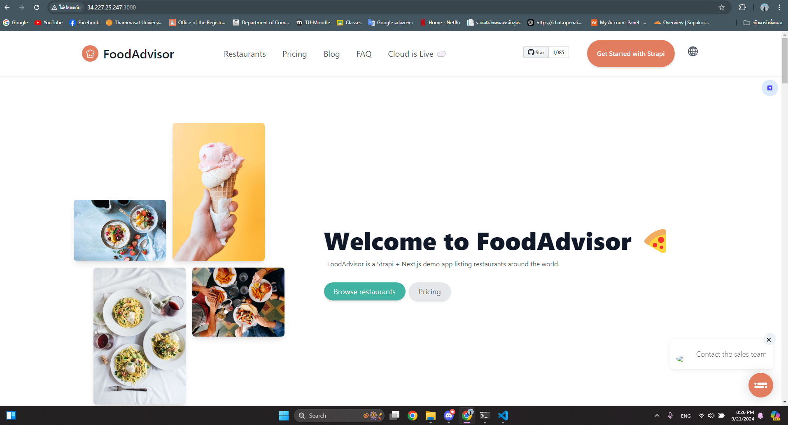
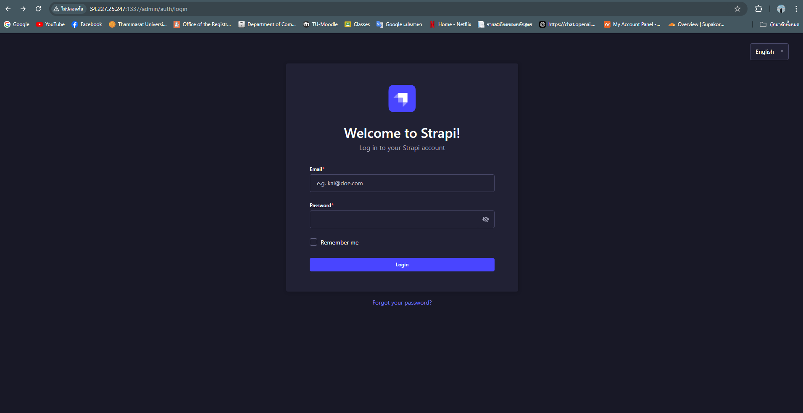

# CS360 1/2567 Term Project: [FoodAdvisor]

## 📋 Group Information 

- **Group Name:** PakPok

- **Members:**   

    | Name                         | Student ID |
    |------------------------------|------------|
    | Sakkapong Phiphatpornchaikul | 6309545033 |
    | Chayanon Khanrit             | 6409682538 |
    | Supakorn Oupkaew             | 6409682918 |
    | Anallena Libha               | 6409682942 |

## 📍 Project Goal
The goal of the FoodAdvisor project is to create a user-friendly platform that facilitates seamless content management and enhances user engagement. The aim is to further enhance this platform to make it even more user-friendly and customizable to meet users' needs. This will deliver a comprehensive solution that simplifies content management, improves the user experience, and fosters collaboration within the food community.

### - Features
- **Feature 1:** User Registration and Authentication
- **Feature 2:** Review and Rating System
- **Feature 3:** Article Publishing Platform
- **Feature 4:** Dynamic Food Menu
- **Feature 5:** Role-Based Access Control

### - Technologies Used
- **Backend:** Strapi V5
- **Frontend:** React.js 
- **Hosting/Deployment:** AWS EC2
- **Database:** SQLite

### - Software Requirement 
- **node:** 16
- **npm:** 8 
- **yarn:** 1
- **curl:** 7
- **nvm:** 0.3
- **git:** 2

## 💻 Setup AWS EC2 Instance

> [!NOTE]
>- **Launch AWS EC2 Instance:**
>    - Instance Type: t2.small
>    - AMI: Ubuntu Server 22.04 LTS (HVM),EBS General Purpose (SSD) Volume Type
>    - Operating System: Amazon Linux
>    - Storage: 1x16 GiB gp2 Root volume
>
>- **Configure Security Group Rules:**
>
>    - Type: SSH, Protocol: TCP, Port Range: 22, Source: ::/0
>
>    - Type: HTTP, Protocol: TCP, Port Range: 80, Source: 0.0.0.0/0, ::/0
>
>
>    - Type: Custom TCP Rule, Protocol: TCP, Port Range: 1337, Source: 0.0.0.0/0
>
>    - Type: Custom TCP Rule, Protocol: TCP, Port Range: 3000, Source: 0.0.0.0/0

### Step by step:
1. **Log into AWS Management Console:**
        
    - Go to the AWS Management Console and `sign in` to your AWS account.

2. **Select EC2 Service:**

    - Click on `Services` and then select `EC2` from the list of services.

3. **Launch Instance:**

    - Click on `Launch Instance` to start the process of creating a new EC2 Instance.

4. **[Choose an Amazon Machine Image (AMI)](#Launch-AWS-EC2-Instance):**

    - Select AMI you want to use.

5. **[Launch AWS EC2 Instance](#Launch-AWS-EC2-Instance):**

    - Select the type of Instance you want to use.
    - Set configurations such as the number of Instances and Network settings according to your needs.

6. **[Add Storage](#Launch-AWS-EC2-Instance):**

    - Choose the size of the storage you want to use.

7. (Optional) **Add Tags:** 

    - Add tags for resource management, such as Name: MyEC2Instance.

8. **[Configure Security Group Rules](#Configure-Security-Group-Rules):** 

    - Create a new Security Group or select an existing one to set rules for accessing the Instance. 

9. **Select Key Pair:**

    - Create a new Key Pair or select an existing Key Pair to allow SSH access to the Instance.

10. **Launch Instance:**

    - Click `Launch Instances` and wait for the EC2 Instance to be created.

11. **Access EC2 Instance:**

    - Use command 
            
            ssh -i "path/to/your-key.pem" ec2-user@<EC2-Public-IP> 
    
        to connect to the EC2 Instance using the IP Address and Key Pair you created. 

## 📌 How to deploy and run the project manually

### Step by step:
After launching your EC2 instance and downloading the key pair for SSH access, follow these steps:

- ### Install curl and node version 16:

    **Run the commands in order:**

    1. Updates the package lists for available software, ensuring you have the latest information.
            
            sudo apt update
        
    2. Installs curl, a tool for transferring data from or to a server.

            sudo apt install curl

    3. Downloads and executes the installation script for Node.js version 16.x.

            curl -fsSL https://deb.nodesource.com/setup_16.x | sudo -E bash -

    4. Installs Node.js without requiring user confirmation.

            sudo apt install -y nodejs

- ### Install git:

    - run 
    
            sudo apt install git 
        
        to install git.

- ### Install yarn:

    **Run the commands in order:**

    1. Downloads Yarn's GPG key and adds it to the system's list of trusted keys, ensuring that packages from the Yarn repository can be verified.

            curl -sS https://dl.yarnpkg.com/debian/pubkey.gpg | sudo apt-key add -

    2. Adds the Yarn APT repository to your system's sources list, allowing you to install Yarn through the package manager.

            echo "deb https://dl.yarnpkg.com/debian/ stable main" | sudo tee /etc/apt/sources.list.d/yarn.list

    3. Updates the local package index, so the system is aware of the latest packages available from the newly added Yarn repository.

            sudo apt update

    4. Installs Yarn, a package manager for JavaScript, using the APT package manager.

            sudo apt install yarn

After install curl, node, git, and yarn, follow these steps: 

1. **Clone the Repository:** 

    - run 
        
            git clone https://github.com/Chayanon6409682538/ProjectCS360_foodadvisor.git

    - Navigate to your project folder by running 
    
            cd ProjectCS360_foodadvisor 
            
        from your command line.

2. **Setup .env:**

    - **backend**

        - To get PublicIPv4 use: 
    
                curl ipinfo.io/ip

        - To get PREVIEW_SECRET use:

                openssl rand -base64 32

        1. **Creat.env File**

                nano  api/.env

        2. **Copy this code and paste in .env file**
    
                HOST=0.0.0.0
                PORT=1337
                STRAPI_ADMIN_CLIENT_URL=http://<Your public IPv4 EC2 instance>:3000
                STRAPI_ADMIN_CLIENT_PREVIEW_SECRET=<Your PREVIEW_SECRET>

    - **frontend**

        1. **Creat.env File**

                nano  client/.env

        2. **Copy this code and paste in .env file**

                NEXT_PUBLIC_API_URL=http://<Your public IPv4 EC2 instance>:1337
                PREVIEW_SECRET=<Your PREVIEW_SECRET>

3. **Start Strapi:** 

    - Navigate to your `./foodadvisor/api` folder by running 
    
            cd api 
            
        from your command line.

    - then run 
    
            yarn && yarn seed && yarn build && yarn start &

4. **Start Next.js:** 

    - Navigate to your `./foodadvisor/client` folder by running 
        
            cd client 
            
        from your command line.

    - then run 
    
            yarn && yarn build && yarn start

5. **Accessing Strapi Backend on EC2:**

    - http://[EC2 public ip]:1337 for strapi backend

6. **Accessing Next.js Frontend on EC2:**

    - http://[EC2 public ip]:3000 next.js frontend

## 📌 How to deploy and run the project using the provided bash script [Specify the bash script path in the repo]

After launching your EC2 instance and downloading the key pair for SSH access, follow this steps:

- ### Install git:

    - run 
    
            sudo apt install git 
        
        to install git.

After install git, follow these steps:

1. **Clone the Repository:** 
    - run 

            git clone https://github.com/Chayanon6409682538/ProjectCS360_foodadvisor.git

    - Navigate to your project folder by running 

            cd ProjectCS360_foodadvisor 
    
        from your command line.

2. **Run the Deployment Script:**

    - Ensure the script is executable by running 

            chmod +x install_strapi_foodadvisor.sh

    - Execute the script by running 

            ./install_strapi_foodadvisor.sh

## 📷 Project Screenshot

